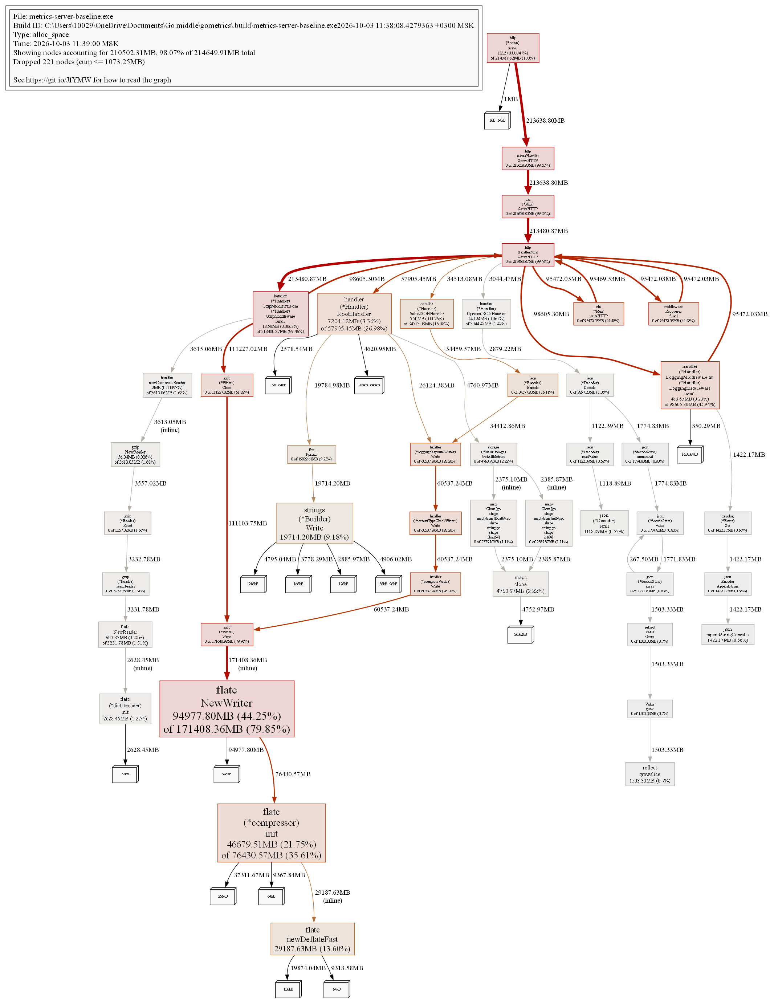
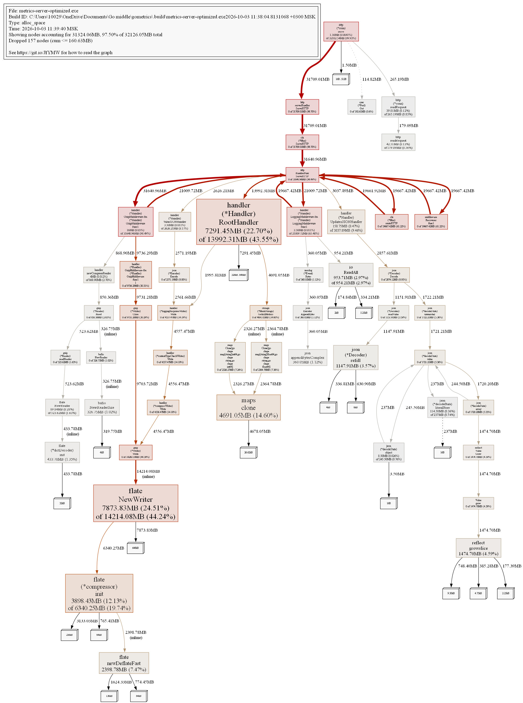

# go-musthave-metrics-tpl

Сервис сбора метрик и алертинга: HTTP-сервер (`cmd/server`) принимает метрики от
агента (`cmd/agent`), хранит их в памяти, в файле или в PostgreSQL и отдаёт по
запросу. Поддерживаются сжатие gzip, подпись HMAC-SHA256 и аудит.

- [Запуск](#запуск)
- [Тесты и покрытие](#тесты-и-покрытие)
- [Бенчмарки](#бенчмарки)
- [Профилирование памяти (pprof)](#профилирование-памяти-pprof)
- [Что было оптимизировано](#что-было-оптимизировано)

## Запуск

```bash
# сервер (память + бэкап в файл)
go run ./cmd/server -a=localhost:8080 -i=300 -f=metrics-store.json

# сервер с профилировщиком (для снятия профилей)
go run ./cmd/server -a=localhost:8080 -f= -i=300 -pprof-addr=localhost:6060

# агент
go run ./cmd/agent -a=localhost:8080 -p=2 -r=10
```

## Тесты и покрытие

```bash
go test ./... -count=1 -coverprofile=coverage.out
go tool cover -func=coverage.out | tail -1
```

Текущее покрытие — **44.1%** (требование спринта — не менее 40%):

```
github.com/subtotalstew/gometrics.git/internal/agent     23.1%
github.com/subtotalstew/gometrics.git/internal/audit     61.9%
github.com/subtotalstew/gometrics.git/internal/handler   52.7%
github.com/subtotalstew/gometrics.git/internal/hash     100.0%
github.com/subtotalstew/gometrics.git/internal/loadgen   85.3%
github.com/subtotalstew/gometrics.git/internal/profiler 100.0%
github.com/subtotalstew/gometrics.git/internal/retry     53.8%
github.com/subtotalstew/gometrics.git/internal/storage   52.1%
total:                                                  44.1%
```

## Бенчмарки

Бенчмарки лежат рядом с тестами (`*_bench_test.go`) и измеряют самые нагруженные
узлы системы:

| Пакет | Что измеряется |
|---|---|
| `internal/storage` | операции `MemStorage` (gauge/counter/batch/снимок), сохранение и загрузка файла |
| `internal/handler` | HTTP-запросы через полный стек middleware (gzip + логирование + hash + chi) на прогретом хранилище из 5000 метрик |
| `internal/agent` | сбор runtime-метрик, формирование и отправка батча агентом |
| `internal/hash` | HMAC-SHA256 для подписи тела запроса (64 B … 64 KiB) |
| `internal/audit` | `Subject.Notify` и запись события в файл |
| `internal/retry` | успешная операция и невосстанавливаемая ошибка |

Запуск:

```bash
go test ./internal/... -run NONE -bench . -benchmem
go test ./internal/handler -run NONE -bench RouterRoot5000Metrics -benchmem
```

### До и после оптимизации

Замеры на одной машине (`-benchtime=1s`), до — коммит `410a598`, после — текущее
состояние:

| Бенчмарк | До | После |
|---|---|---|
| BenchmarkRouterRoot5000Metrics | 5631124 ns/op · 3651396 B/op · 15097 allocs | 1699342 ns/op · 1114145 B/op · **50 allocs** |
| BenchmarkRouterUpdatesJSONGzip_100 | 151997 ns/op · 103546 B/op · 356 allocs | 119460 ns/op · 55845 B/op · 340 allocs |
| BenchmarkRouterUpdatesJSON_100 | 110306 ns/op · 57031 B/op · 347 allocs | 109692 ns/op · 51264 B/op · 337 allocs |
| BenchmarkRouterUpdateJSON | 3742 ns/op · 2914 B/op · 34 allocs | 2415 ns/op · 2173 B/op · 24 allocs |
| BenchmarkRouterValueJSON | 3063 ns/op · 2882 B/op · 33 allocs | 2335 ns/op · 2157 B/op · 23 allocs |
| BenchmarkRouterUpdatePath | 2731 ns/op · 2047 B/op · 20 allocs | 1300 ns/op · 1367 B/op · 11 allocs |
| BenchmarkRouterValuePath | 3615 ns/op · 2049 B/op · 20 allocs | 1576 ns/op · 1368 B/op · 11 allocs |
| BenchmarkLoggingMiddlewareOnly | 1352 ns/op · 1350 B/op · 15 allocs | 670 ns/op · 611 B/op · 5 allocs |
| BenchmarkRouterUpdateJSONWithHash | 5728 ns/op · 4348 B/op · 51 allocs | 4849 ns/op · 3607 B/op · 41 allocs |
| BenchmarkAgentSendMetricsBatch | 349067 ns/op · 883159 B/op · 137 allocs | 106621 ns/op · 42758 B/op · 94 allocs |
| BenchmarkAgentSendMetricsBatch_1000 | 657278 ns/op · 1012577 B/op · 143 allocs | 399864 ns/op · 181846 B/op · 104 allocs |

## Профилирование памяти (pprof)

### Как снимались профили

1. Сервис запускается с профилировщиком (`-pprof-addr`, см. `internal/profiler`):

   ```bash
   go build -o .build/metrics-server-baseline.exe ./cmd/server   # «до»
   go build -o .build/metrics-server-optimized.exe ./cmd/server  # «после»

   .build/metrics-server-optimized.exe -a=127.0.0.1:8080 -f= -pprof-addr=127.0.0.1:6060
   ```

2. Нагрузка создаётся инструментом `_tools/loadgen` (реализация — `internal/loadgen`):
   он сначала заводит 5000 уникальных метрик, а затем гоняет смесь запросов,
   повторяющую поведение реального агента:

   ```
   55%  POST /updates/            (батч из 100 метрик, gzip)
   20%  POST /value               (JSON)
   10%  GET  /value/{type}/{name}
   15%  GET  /                   (страница со всеми метриками)
   ```

   ```bash
   go run ./_tools/loadgen -addr=http://127.0.0.1:8080 -workers=8 \
       -requests=150000 -duration=5m -metrics=5000 -batch=100
   ```

   Число запросов фиксировано (`-requests=150000`), поэтому профили «до» и «после»
   сняты на **одинаковом объёме работы** — это обязательное условие корректного
   сравнения.

3. Профиль снимается сразу после нагрузки, пока занятая память ещё не собрана:

   ```bash
   curl -s -o profiles/base.pprof   http://127.0.0.1:6060/debug/pprof/allocs
   curl -s -o profiles/result.pprof http://127.0.0.1:6060/debug/pprof/allocs
   ```

   Используется эндпоинт `/debug/pprof/allocs` (те же данные, что и у `/heap`), у
   которого типом выборки по умолчанию является `alloc_space` — суммарный объём
   аллокаций. Именно эта метрика отвечает на вопрос «сколько памяти код
   запрашивает», не зависит от момента срабатывания GC и поэтому пригодна для
   сравнения двух прогонов. Посмотреть удержанную память по тем же файлам можно
   командой `go tool pprof -sample_index=inuse_space ...`.

### Изучение профиля «до» (base.pprof)

`top` — самые «тяжёлые» с точки зрения аллокаций функции:

```
$ go tool pprof -top profiles/base.pprof
File: metrics-server-baseline.exe
Type: alloc_space
Time: 2026-10-03 11:39:00 MSK
Showing nodes accounting for 205.56GB, 98.06% of 209.62GB total
Dropped 221 nodes (cum <= 1.05GB)
Showing top 15 nodes out of 44
      flat  flat%   sum%        cum   cum%
   92.75GB 44.25% 44.25%   167.39GB 79.85%  compress/flate.NewWriter (inline)
   45.59GB 21.75% 65.99%    74.64GB 35.61%  compress/flate.(*compressor).init
   28.50GB 13.60% 79.59%    28.50GB 13.60%  compress/flate.newDeflateFast (inline)
   19.25GB  9.18% 88.78%    19.25GB  9.18%  strings.(*Builder).Write
    7.04GB  3.36% 92.13%    56.55GB 26.98%  github.com/subtotalstew/gometrics.git/internal/handler.(*Handler).RootHandler
    4.65GB  2.22% 94.35%     4.65GB  2.22%  maps.clone
    2.57GB  1.22% 95.58%     2.57GB  1.22%  compress/flate.(*dictDecoder).init (inline)
    1.47GB   0.7% 96.28%     1.47GB   0.7%  reflect.growslice
    1.39GB  0.66% 96.94%     1.39GB  0.66%  github.com/rs/zerolog/internal/json.appendStringComplex
    1.09GB  0.52% 97.46%     1.09GB  0.52%  encoding/json.(*Decoder).refill
    0.59GB  0.28% 97.74%     3.16GB  1.51%  compress/flate.NewReader
    0.47GB  0.23% 97.97%    96.29GB 45.94%  github.com/subtotalstew/gometrics.git/internal/handler.(*Handler).LoggingMiddleware-fm.(*Handler).LoggingMiddleware.func1
    0.14GB 0.065% 98.03%     2.97GB  1.42%  github.com/subtotalstew/gometrics.git/internal/handler.(*Handler).UpdatesJSONHandler
    0.05GB 0.026% 98.06%     3.53GB  1.68%  compress/gzip.NewReader (inline)
    0.01GB 0.0063% 98.06%   208.48GB 99.46%  github.com/subtotalstew/gometrics.git/internal/handler.(*Handler).GzipMiddleware-fm.(*Handler).GzipMiddleware.func1
```

`list RootHandler` — построчная разбивка по «горячей» функции (ниже приведён
фрагмент, длинные HTML-литералы опущены):

```
$ go tool pprof -list RootHandler profiles/base.pprof
Total: 209.85GB
ROUTINE ======================== github.com/subtotalstew/gometrics.git/internal/handler.(*Handler).RootHandler
    6.99GB    56.48GB (flat, cum) 26.91% of Total
         .     4.64GB    180: gauges, counters := h.storage.GetAllMetrics()
         ...
    1.50MB     1.50MB    182: var html strings.Builder
         .     8.50MB    183: html.WriteString(`<!DOCTYPE html> ...
         ...
    1.26GB    12.27GB    204:     fmt.Fprintf(&html, `<tr><td>%s</td><td>%g</td></tr>`, name, value)
         ...
    1.25GB     9.52GB    217:     fmt.Fprintf(&html, `<tr><td>%s</td><td>%d</td></tr>`, name, value)
         ...
    4.47GB    30.03GB    227: w.Write([]byte(html.String()))
```

`peek` — кто вызывает тяжёлый участок и куда уходят аллокации:

```
$ go tool pprof -peek 'gzip.\(\*Writer\).Write' profiles/base.pprof
Showing nodes accounting for 214649.91MB, 100% of 214649.91MB total
----------------------------------------------------------+-------------
      flat  flat%   sum%        cum   cum%   calls calls% + context
----------------------------------------------------------+-------------
                                       111103.75MB 64.73% |   compress/gzip.(*Writer).Close
                                        60537.24MB 35.27% |   github.com/subtotalstew/gometrics.git/internal/handler.(*compressWriter).Write
         0     0%     0% 171640.98MB 79.96%                | compress/gzip.(*Writer).Write
                                       171408.36MB 99.86% |   compress/flate.NewWriter (inline)
                                          232.62MB  0.14% |   compress/flate.(*Writer).Write (inline)
----------------------------------------------------------+-------------
```

`web`/граф — та же картина в виде дерева вызовов
([profiles/base-alloc-graph.png](profiles/base-alloc-graph.png)):



Для справки: `go tool pprof -list` подтягивает исходники по пути, записанному в
профиле, поэтому для `base.pprof` он работает, если развёрнут baseline-коммит
`410a598` (для `result.pprof` — всегда, исходники лежат в репозитории).

### Найденные проблемы

1. **`GzipMiddleware` создавал новый `gzip.Writer` на каждый запрос** — 80% всех
   аллокаций (`flate.NewWriter` + `compressor.init` + `newDeflateFast`). Один
   writer уровня `BestSpeed` резервирует ~1 МБ под словари и состояние deflate.
2. **`RootHandler` собирал страницу через `strings.Builder` + `fmt.Fprintf`**
   (19.25 ГБ на рост буфера и ~22 ГБ на рефлексию `fmt`), а затем дважды копировал
   результат: `html.String()` и `[]byte(...)` — 15097 аллокаций на запрос.
3. **`LoggingMiddleware` делал `string(bodyBytes)`** для передачи тела в zerolog
   (`appendStringComplex` — 1.39 ГБ) и собирал `map[string][]string` для
   `Interface("req_headers", ...)` на каждом запросе.
4. **Агент создавал новый `gzip.Writer` на каждый батч** — 883 КБ аллокаций на
   отправку.

### Что было оптимизировано

| Место | Было | Стало |
|---|---|---|
| `handler.GzipMiddleware` | `gzip.NewWriterLevel` на каждый запрос | `sync.Pool` писателей (`gzip.Writer.Reset`) — 92.75 ГБ аллокаций убрано |
| `handler.newCompressReader` | `gzip.NewReader` на каждый сжатый запрос | `sync.Pool` читателей (`gzip.Reader.Reset`) |
| `handler.RootHandler` | `strings.Builder` + `fmt.Fprintf` + `[]byte(html.String())` | один `[]byte` с предварительной оценкой размера, `strconv.AppendFloat/AppendInt`, запись напрямую в `http.ResponseWriter` |
| `handler.LoggingMiddleware` | `Str("req_body_raw", string(body))`, `Interface("req_headers", map…)` | `Bytes("req_body_raw", body)`, `Strs(...)` без промежуточной map и строки |
| `agent.sendMetricsBatch` / `sendMetricJSON` | `gzip.NewWriter` на каждый батч | общий `sync.Pool` (`internal/agent/compressGzip`) |
| инфраструктура | — | `internal/profiler` (эндпоинты pprof), `internal/loadgen` + `_tools/loadgen`, бенчмарки |

Отдельно про пул gzip-писателей: `sync.Pool` удерживает до `GOMAXPROCS`
писателей (~1 МБ каждый), но эта память освобождается сборщиком мусора
(victim-кэш пула очищается на GC) и с запасом окупается шестикратным снижением
объёма аллокаций — см. diff ниже.

### Результат

```
$ go tool pprof -top -diff_base=profiles/base.pprof profiles/result.pprof
File: metrics-server-optimized.exe
Type: alloc_space
Showing nodes accounting for -180964.28MB, 84.31% of 214649.91MB total
Dropped 218 nodes (cum <= 1073.25MB)
      flat  flat%   sum%        cum   cum%
-87103.97MB 40.58% 40.58% -157194.29MB 73.23%  compress/flate.NewWriter (inline)
-42781.08MB 19.93% 60.51% -70090.32MB 32.65%  compress/flate.(*compressor).init
-26788.85MB 12.48% 72.99% -26788.85MB 12.48%  compress/flate.newDeflateFast (inline)
-19714.20MB  9.18% 82.17% -19714.20MB  9.18%  strings.(*Builder).Write
-2194.68MB  1.02% 83.20% -2194.68MB  1.02%  compress/flate.(*dictDecoder).init (inline)
-1422.17MB  0.66% 83.86% -1422.17MB  0.66%  github.com/rs/zerolog/internal/json.appendStringComplex
 -513.49MB  0.24% 84.10% -2708.16MB  1.26%  compress/flate.NewReader
 -480.15MB  0.22% 84.32% -77595.57MB 36.15%  github.com/subtotalstew/gometrics.git/internal/handler.(*Handler).LoggingMiddleware-fm.(*Handler).LoggingMiddleware.func1
   87.33MB 0.041% 84.28% -43913.14MB 20.46%  github.com/subtotalstew/gometrics.git/internal/handler.(*Handler).RootHandler
  -56.04MB 0.026% 84.31%  -3613.05MB  1.68%  compress/gzip.NewReader (inline)
    2.50MB 0.0012% 84.31% -181839.91MB 84.71%  github.com/subtotalstew/gometrics.git/internal/handler.(*Handler).GzipMiddleware-fm.(*Handler).GzipMiddleware.func1
      -2MB 0.00093% 84.31% -31886.87MB 14.86%  github.com/subtotalstew/gometrics.git/internal/handler.(*Handler).ValueJSONHandler
       2MB 0.00093% 84.31%  -2746.15MB  1.28%  github.com/subtotalstew/gometrics.git/internal/handler.newCompressReader
    0.50MB 0.00023% 84.31% -182485.27MB 85.02%  net/http.(*conn).serve
         0     0% 84.31% -2706.65MB  1.26%  compress/gzip.(*Reader).Reset
         0     0% 84.31% -2709.16MB  1.26%  compress/gzip.(*Reader).readHeader
         0     0% 84.31% -101495.74MB 47.28%  compress/gzip.(*Writer).Close
         0     0% 84.31% -157380.79MB 73.32%  compress/gzip.(*Writer).Write
         0     0% 84.31% -32006.64MB 14.91%  encoding/json.(*Encoder).Encode
         0     0% 84.31% -19809.56MB  9.23%  fmt.Fprintf
         0     0% 84.31% -181929.79MB 84.76%  github.com/go-chi/chi/v5.(*Mux).ServeHTTP
         0     0% 84.31% -75804.60MB 35.32%  github.com/go-chi/chi/v5.(*Mux).routeHTTP
         0     0% 84.31% -75804.60MB 35.32%  github.com/go-chi/chi/v5/middleware.Recoverer.func1
         0     0% 84.31% -1422.17MB  0.66%  github.com/rs/zerolog.(*Event).Str
         0     0% 84.31% -1422.17MB  0.66%  github.com/rs/zerolog/internal/json.Encoder.AppendString
         0     0% 84.31%  9736.29MB  4.54%  github.com/subtotalstew/gometrics.git/internal/handler.(*Handler).GzipMiddleware-fm.(*Handler).GzipMiddleware.func1.1
         0     0% 84.31% -55980.77MB 26.08%  github.com/subtotalstew/gometrics.git/internal/handler.(*compressWriter).Write
         0     0% 84.31% -55979.77MB 26.08%  github.com/subtotalstew/gometrics.git/internal/handler.(*contentTypeCheckWriter).Write
         0     0% 84.31% -55979.77MB 26.08%  github.com/subtotalstew/gometrics.git/internal/handler.(*loggingResponseWriter).Write
         0     0% 84.31% -181839.91MB 84.71%  net/http.HandlerFunc.ServeHTTP
         0     0% 84.31% -181929.79MB 84.76%  net/http.serverHandler.ServeHTTP
```

Все ключевые строки отрицательные: суммарный объём аллокаций на одинаковой
нагрузке (150 000 запросов) упал с **209.6 ГБ до 32.9 ГБ — в 6.4 раза**.
Единственная положительная строка, `GzipMiddleware.func1.1` (+9.7 ГБ), — это
`defer`-замыкание, возвращающее writer в пул: она заменила собой десятки гигабайт
аллокаций, которые раньше приходились на `flate.NewWriter`.

Разница видна и построчно — в `RootHandler` вместо тысяч мелких аллокаций
осталась одна:

```
$ go tool pprof -list RootHandler profiles/result.pprof
Total: 31.37GB
ROUTINE ======================== github.com/subtotalstew/gometrics.git/internal/handler.(*Handler).RootHandler
    7.12GB    13.66GB (flat, cum) 43.55% of Total
         .     4.58GB    228: gauges, counters := h.storage.GetAllMetrics()
    7.12GB     7.12GB    230: buf := make([]byte, 0, rootPageSize(len(gauges), len(counters)))
```

Профиль «после»: [profiles/result.pprof](profiles/result.pprof), граф —
[profiles/result-alloc-graph.png](profiles/result-alloc-graph.png).



## Структура проекта

```
cmd/server, cmd/agent   – точки входа сервиса и агента
internal/handler        – HTTP-хендлеры и middleware (gzip, логи, подпись)
internal/storage        – хранилища: память, файл, PostgreSQL
internal/agent          – сбор и отправка метрик
internal/audit          – аудит событий (файл, URL)
internal/hash, retry    – подпись HMAC-SHA256 и повторные попытки
internal/profiler       – HTTP-сервер с эндпоинтами net/http/pprof
internal/loadgen        – генератор нагрузки для снятия профилей
_tools/loadgen          – CLI поверх internal/loadgen
profiles                – профили памяти base.pprof / result.pprof и их графы
```

Профили и графы воспроизводятся командами из раздела
[«Профилирование памяти»](#профилирование-памяти-pprof). Вспомогательные бинарники
складываются в `.build/` (в репозиторий не попадают).

## Обновление шаблона

```bash
git remote add -m v2 template https://github.com/Yandex-Practicum/go-musthave-metrics-tpl.git
git fetch template && git checkout template/v2 .github
```

Для запуска автотестов называйте ветки `iter<number>`. При мёрже ветки с
инкрементом в `main` запускаются все автотесты. Подробнее — в
[README автотестов](https://github.com/Yandex-Practicum/go-autotests).
